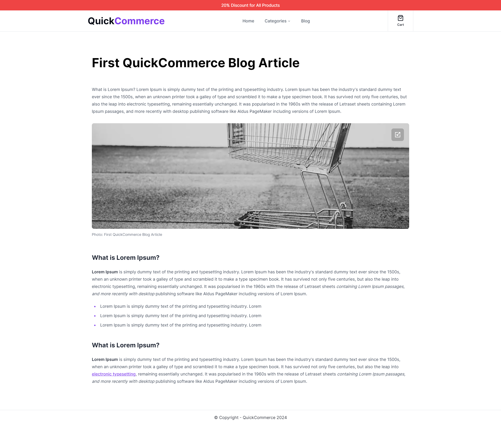

# QuickCommerce - Next.js 14 Ecommerce App with Blog section

Features:

- Tailwind design + Shadcn/ui
- Typescript
- SEO Friendly Application - (SSG + ISR)
- Plaiceholder blurred images for server and client components
- GSAP animation
- Sanity integration
- Stripe integration 
- Client Side Pagination
- Fake discount (ability to disable or set your own fake discount value)
- SEO Friendly Blog Section - Custom metadata + PortableText

##  [Visit project url](https://quick-commerce-theta.vercel.app/)

  

  

  

  

